## **pumpkyn v1.0 — October 2025**

Welcome to pumpkyn, an open\-source toolbox for exploring tulip\-shaped orbits in the Earth–Moon Circular Restricted Three\-Body Problem (CR3BP). Pumpkyn provides a hands\-on environment for generating, propagating, and analyzing novel tulip\-shaped families of periodic solutions, which offer unique opportunities for cislunar navigation, communications, and science missions.


Designed as both a training resource and a preliminary mission design toolkit, pumpkyn makes  three\-body dynamics accessible through a curated set of routines for orbit continuation, stability assessment, invariant manifold generation, station\-keeping cost estimation, and Earth\-centered/J2000 frame conversion. Its tutorial scripts and examples allow students and researchers to build intuition for multi\-body dynamics, while its engineering\-grade functions give mission designers the ability to quickly explore architectures and trade studies in the cislunar regime.

# Toolbox Installation
1.  Download Pumpkyn.mltbx or clone this repository.
2. In MATLAB, either double\-click the `.mltbx` file **or** run the following command:
```matlab
matlab.addons.install('pumpkyn.mltbx');
```
# Startup File (Manual Installation)

If you prefer **not** to install the toolbox, simply run `startup.m` to add the Pumpkyn folder and subfolders to your MATLAB path:

```matlab
run('startup.m');
```

Tutorials and examples can be found under the `/doc` directory.

# Tutorials

This section offers step\-by\-step examples that demonstrate how to use pumpkyn’s functions in practical workflows. The tutorials highlight common analysis tasks such as orbit generation, coverage evaluation, and station\-keeping fuel requirements, and are organized to help users move from basic exploration to more advanced mission design studies.

|||
| :-- | :-- |
| [**Extracting Tulip\-Shaped Obits and Properties**](./doc/md/intro_tulip.md) <br> Generates tulip\-shaped orbits in the Earth–Moon CR3BP. Retrieves a full family of tulip\-shaped trajectories for a chosen petal count, and computes key properties such as stability index, Jacobi constant, perilune, apolune, and lunar occultation.   | 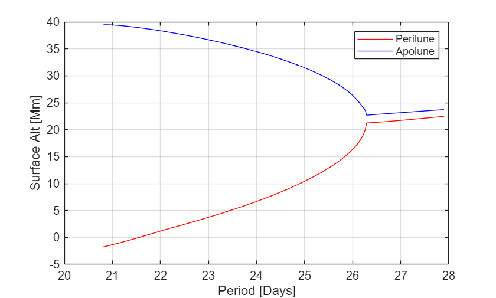   |
| [**Creating a Pumpkin Orbit**](./doc/md/intro_pumpkyn.md) <br> Generate, propagate, and visualize a 13\-petal pumpkin\-shaped orbit. Key properties such as stability index, Jacobi constant, perilune/apolune altitudes, and lunar occultation are computed to help assess the orbit’s stability and mission suitability for cislunar operations.  | 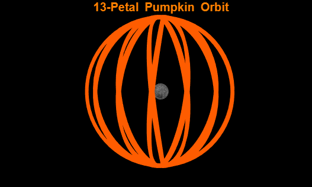   |
| [**Zero Velocity Surface Analysis**](./doc/md/zeroVelocity.md) <br> Visualize the zero\-velocity surfaces in the CR3BP. Compute the Jacobi constant across cislunar space and overlay a 9\-petal tulip orbit with C = 3.1777, showing that its energy allows motion toward Earth through L1 but prevents escape through L2 into deep space.  | 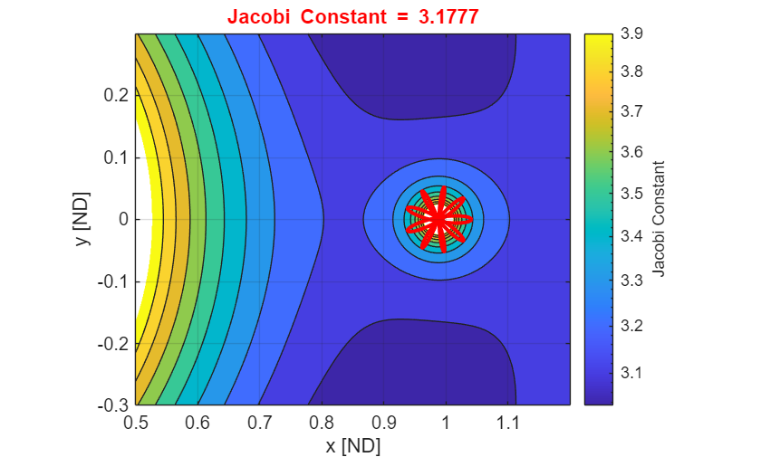   |
| [**Station\-Keeping Estimation Demonstration**](./doc/md/stationKeepingEst.md) <br> Estimates the station\-keeping costs for a pumpkin\-shaped orbit. It applies linear stability theory to compute upper and lower ΔV bounds for various correction intervals, and plots the results. These bounds provide insight into how frequently maneuvers are needed and the total annual ΔV required to maintain orbit stability.  | 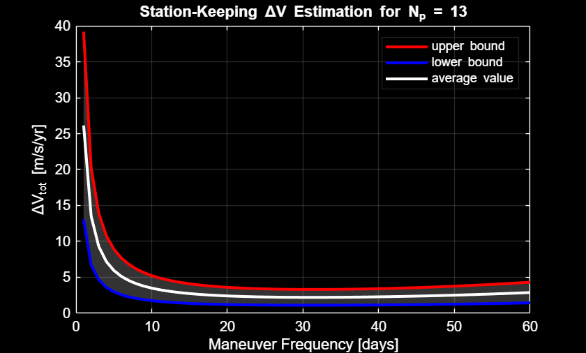   |
| [**Pseudo\-Arclength Continuation (Tulips to Pumpkins)**](./doc/md/tulipContinuation.md) <br> Extends a tulip\-shaped orbit using pseudo\-arclength continuation in the Earth–Moon CR3BP. Starting from a seed orbit, the routine incrementally adjusts the initial states to find new family members. The resulting visualization shows how orbital geometry evolves with period.  | 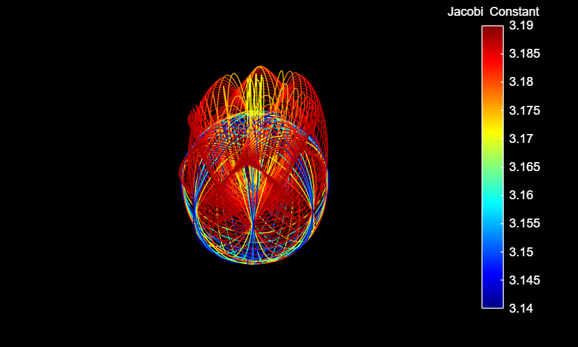   |
| [**Finding Unstable Manifolds**](./doc/md/manifolds.md) <br> Compute and visualize the invariant manifolds of a tulip\-shaped orbit. We calculate the stability index and trace the unstable manifolds that diverge from its periodic path. These manifolds reveal low\-energy transfer routes which support useful dynamical pathways for mission design and long\-term orbit analysis.  | 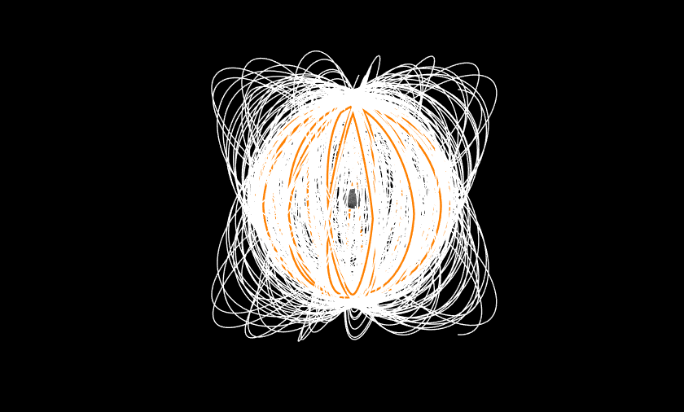   |
| [**Designing a Tulip\-Shaped Orbit Constellation**](./doc/md/intro_constellation.md) <br> Generate a tulip\-shaped satellite constellation in the Earth–Moon CR3BP. We create a set of satellites evenly spaced in time along a multi\-petal tulip orbit and plots their trajectories in the barycentric rotating frame. The example illustrates how to design tulip\-shaped constellations for cislunar missions.  | 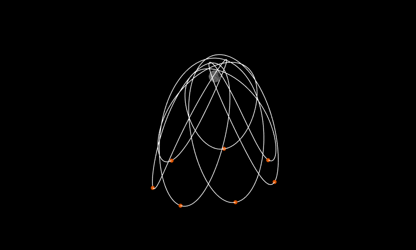   |
| [**Minimum Energy Transfers**](./doc/md/minEnergy.md) <br> Estimates the minimum energy ΔV required for a spacecraft in a tulip\-shaped orbit to reach the lunar surface. It computes the lowest ΔV across all surface points and visualizes these energy contours. Results highlight optimal surface\-access regions and provide insight into low\-energy transfer opportunities.  | 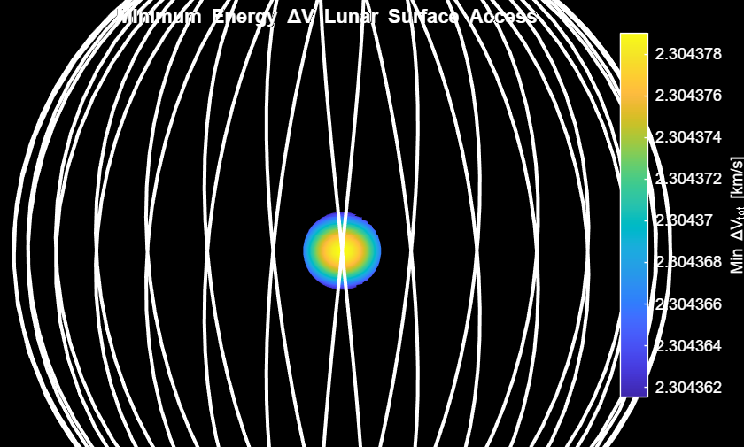   |
| [**Coordinate Transformations from J2000 to CR3BP**](./doc/md/j2k2cr3bp.md) <br> Converts a lunar orbit from the Moon\-centered inertial frame to the barycentric rotating frame. A low lunar orbit is initialized, transformed into the rotating reference frame, and propagated in the CR3BP, demonstrating how to bridge classical two\-body dynamics with the multi\-body environment for cislunar mission analysis.  | 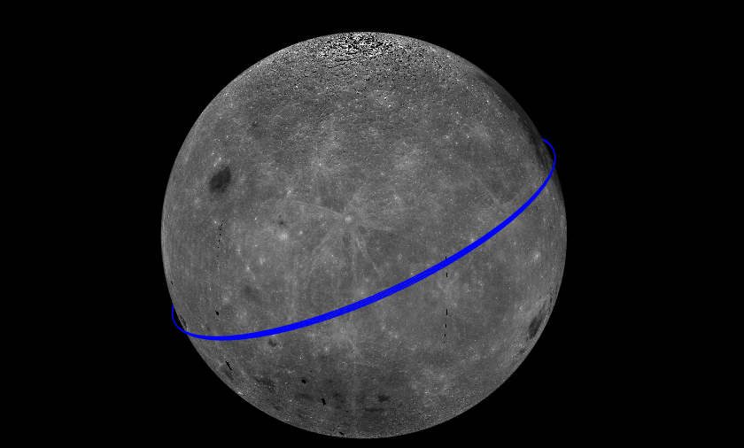   |
| [**Coordinate Transformations from CR3BP to J2000**](./doc/md/cr3bp2j2k.md) <br> Converts a 13\-petal pumpkin orbit from the barycentric rotating frame to the Moon\-centered inertial frame. A pumpkin orbit is initialized, propagated in the CR3BP, then transformed into the J2000 frame demonstrating how to bridge the CR3BP model with a higher fidelity multi\-body environment for cislunar mission analysis.  | 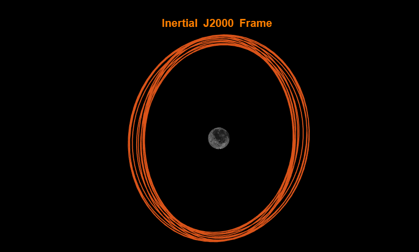   |
| [**Lunar Surface Coverage Analysis**](./doc/md/surfCoverage.md) <br> A tulip\-shaped satellite constellation is generated, the lunar surface is approximated by discrete ground points, and coverage gaps are computed based on a minimum elevation angle. The results visualize maximum uncovered gap times across the Moon, helping assess coverage performance for cislunar constellations.  | 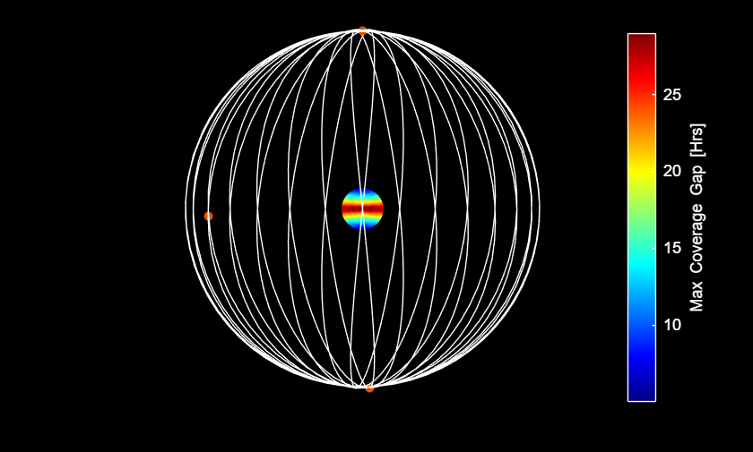   |
| [**Lunar South Pole GDOP Analysis**](./doc/md/intro_gdop.md) <br> Compute the geometric dilution of precision (GDOP) at the lunar south pole in the CR3BP framework. We use a 7\-petal, 6:5 resonant tulip constellation optimized for coverage and calculate GDOP over time. The results show how geometry affects navigation accuracy and help us evaluate positioning performance in cislunar space.  | 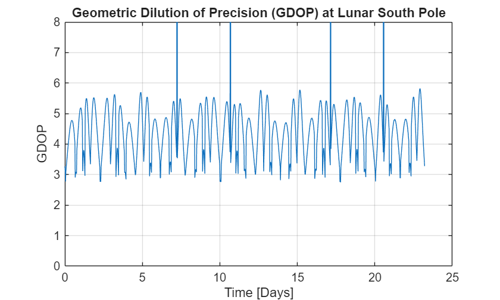   |


Together, these tutorials provide a comprehensive introduction to modeling, analyzing, and designing periodic and resonant trajectories in the Earth–Moon system.

# References
1.  Koblick, Darin C., and Brian McCarthy. "Station\-Keeping Techniques for Sidereal Resonant Tulip\-Shaped Three\-Body Orbits. AIAA SciTech Forum, Orlando, FL. 2026.
2. Koblick, Darin C., and Patrick Kelly. "Novel Three\-body Tulip\-Shaped Orbit Families for Lunar Missions." *The Journal of the Astronautical Sciences* 72.4 (2025): 32.
3. Koblick, Darin C. "Novel tulip\-shaped three\-body orbits for cislunar space domain awareness missions." *Proceedings of the Advanced Maui Optical and Space Surveillance (AMOS) Technologies Conference*. Maui, HI. 2023.

Source code is actively maintained by Coorbital Inc, with ongoing updates to expand functionality and improve usability. As new mission needs and research opportunities emerge, we welcome collaboration and can provide custom features, tailored analyses, or specialized extensions upon request. For inquiries, suggestions, or feature requests, please reach out.


[www.coorbital.com](http://www.coorbital.com) | [info@coorbital.com](mailto:info@coorbital.com)


***Disclaimer****: Pumpkyn Toolbox is provided “as is,” without warranty of any kind, express or implied. Coorbital Inc. does not guarantee the accuracy or reliability of any results produced and is not responsible for any damages, losses, or consequences arising from its use.*


For licensing terms, see [license.txt](./LICENSE)

